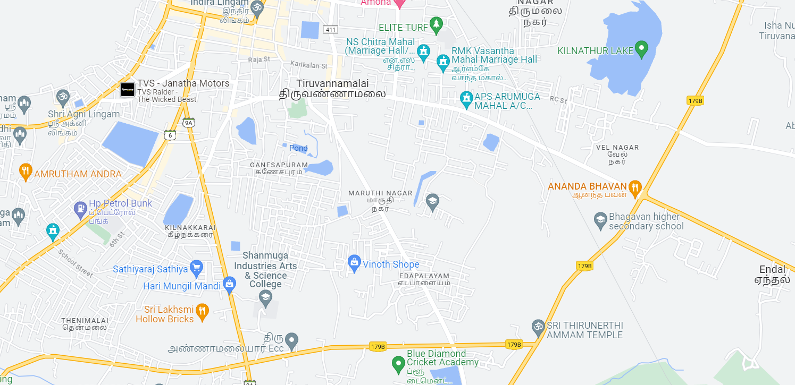
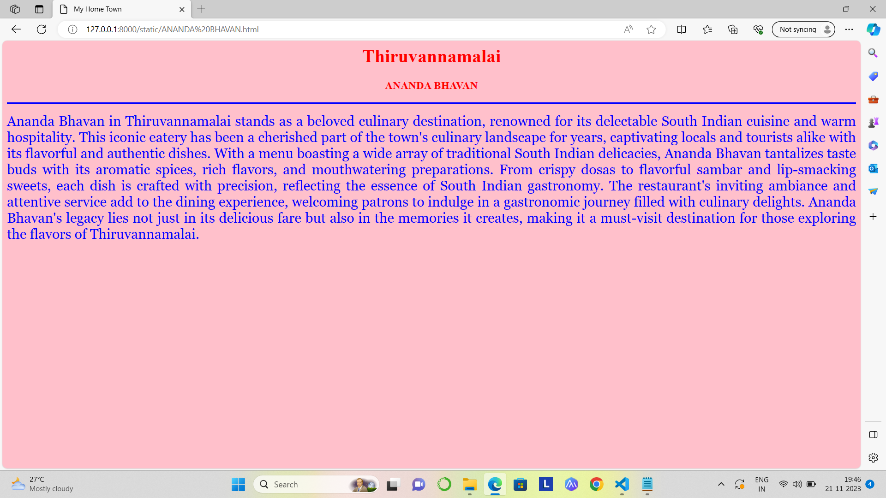
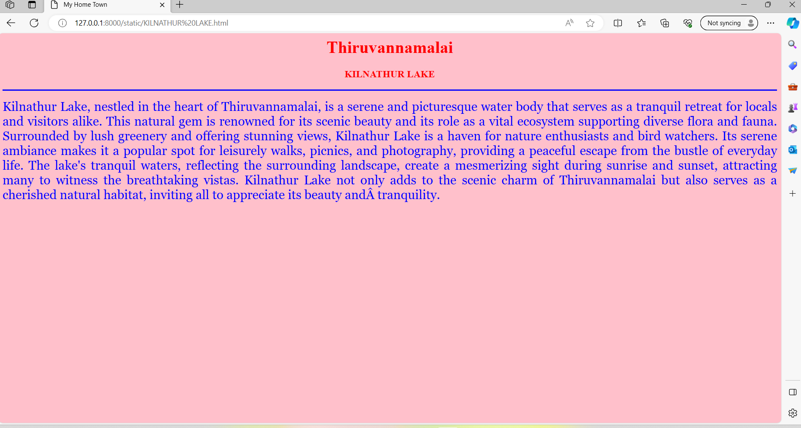
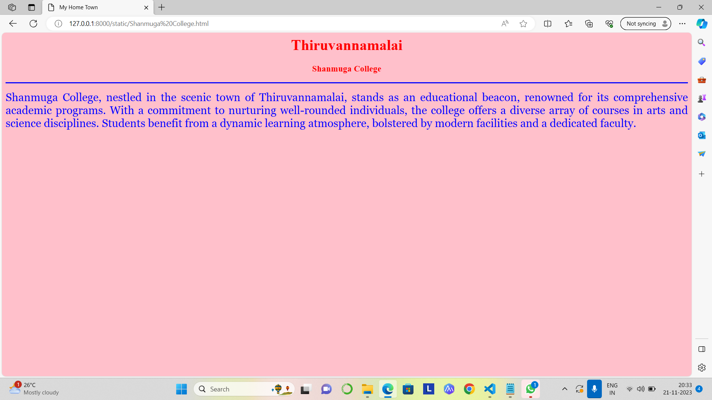
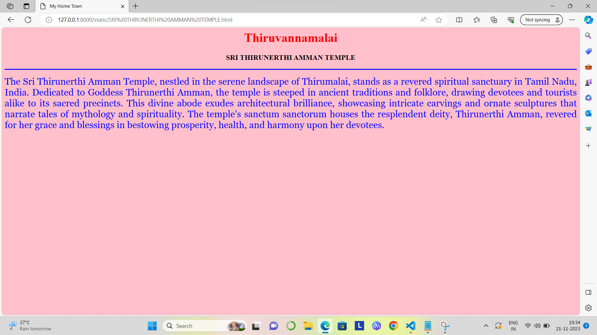
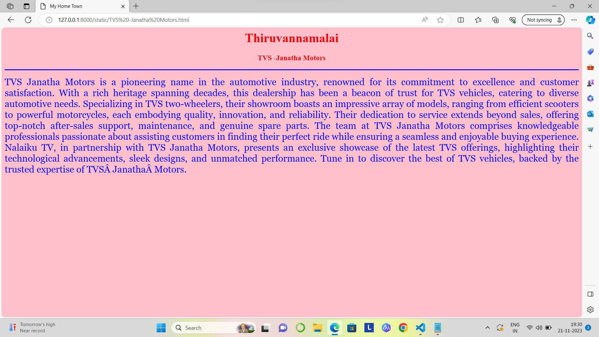

# Ex04 Places Around Me
## Date: 22-11-2023

## AIM
To develop a website to display details about the places around my house.

## DESIGN STEPS

### STEP 1
Create a Django admin interface.

### STEP 2
Download your city map from Google.

### STEP 3
Using ```<map>``` tag name the map.

### STEP 4
Create clickable regions in the image using ```<area>``` tag.

### STEP 5
Write HTML programs for all the regions identified.

### STEP 6
Execute the programs and publish them.

## CODE
```Mycity.html
<html>
<head>
<title>My City</title>
</head>
<body>
<h1 align="center">
<font color="red"><b>Thiruvannamalai</b></font>
</h1>
<h3 align="center">
<font color="blue"><b>Yuva Sree M (23013768)</b></font>
</h3>
<center>

<map name="MyCity">
<area shape="RECT" coords="200,120,260,160" href="TVS -Janatha Motors.html" title="TVS - Janatha Motors">
<area shape="RECT" coords="370,390,480,490" href="Shanmuga College.html"title="Shanmuga College">
<area shape="RECT" coords="850,500,1030,550" href="SRI THIRUNERTHI AMMAN TEMPLE.html" title="SRI THIRUNERTHI AMMAN TEMPLE">
<area shape="RECT" coords="900,270,1050,320" href="ANANDA BHAVAN.html" title="ANANDA BHAVAN">
<area shape="RECT" coords="890,60,1050,100" href="KILNATHUR LAKE.html" title="KILNATHUR LAKE">
</map>
</center>
</body>
</html>

ANANDA BHAVAN.html

<html>
<head>
<title>My Home Town</title>
</head>
<body bgcolor="pink">
<h1 align="center">
<font color="red"><b>Thiruvannamalai</b></font>
</h1>
<h3 align="center">
<font color="red"><b>ANANDA BHAVAN</b></font>
</h3>
<hr size="3" color="blue">
<p align="justify">
<font face="Georgia" size="5" color="blue">
    Ananda Bhavan in Thiruvannamalai stands as a beloved culinary destination, renowned for its delectable South Indian cuisine and warm hospitality. This iconic eatery has been a cherished part of the town's culinary landscape for years, captivating locals and tourists alike with its flavorful and authentic dishes.

With a menu boasting a wide array of traditional South Indian delicacies, Ananda Bhavan tantalizes taste buds with its aromatic spices, rich flavors, and mouthwatering preparations. From crispy dosas to flavorful sambar and lip-smacking sweets, each dish is crafted with precision, reflecting the essence of South Indian gastronomy.

The restaurant's inviting ambiance and attentive service add to the dining experience, welcoming patrons to indulge in a gastronomic journey filled with culinary delights. Ananda Bhavan's legacy lies not just in its delicious fare but also in the memories it creates, making it a must-visit destination for those exploring the flavors of Thiruvannamalai.
</font>
</p>
</body>
</html>


KILNATHUR LAKE.html

<html>
<head>
<title>My Home Town</title>
</head>
<body bgcolor="pink">
<h1 align="center">
<font color="red"><b>Thiruvannamalai</b></font>
</h1>
<h3 align="center">
<font color="red"><b>KILNATHUR LAKE</b></font>
</h3>
<hr size="3" color="blue">
<p align="justify">
<font face="Georgia" size="5" color="blue">
    Kilnathur Lake, nestled in the heart of Thiruvannamalai, is a serene and picturesque water body that serves as a tranquil retreat for locals and visitors alike. This natural gem is renowned for its scenic beauty and its role as a vital ecosystem supporting diverse flora and fauna.

Surrounded by lush greenery and offering stunning views, Kilnathur Lake is a haven for nature enthusiasts and bird watchers. Its serene ambiance makes it a popular spot for leisurely walks, picnics, and photography, providing a peaceful escape from the bustle of everyday life.

The lake's tranquil waters, reflecting the surrounding landscape, create a mesmerizing sight during sunrise and sunset, attracting many to witness the breathtaking vistas. Kilnathur Lake not only adds to the scenic charm of Thiruvannamalai but also serves as a cherished natural habitat, inviting all to appreciate its beauty and tranquility.
</font>
</p>
</body>
</html>

Shanmuga College.html

<html>
<head>
<title>My Home Town</title>
</head>
<body bgcolor="pink">
<h1 align="center">
<font color="red"><b>Thiruvannamalai</b></font>
</h1>
<h3 align="center">
<font color="red"><b>Shanmuga College</b></font>
</h3>
<hr size="3" color="blue">
<p align="justify">
<font face="Georgia" size="5" color="blue">
    Shanmuga  College, nestled in the scenic town of Thiruvannamalai, stands as an educational beacon, renowned for its comprehensive academic programs. With a commitment to nurturing well-rounded individuals, the college offers a diverse array of courses in arts and science disciplines. Students benefit from a dynamic learning atmosphere, bolstered by modern facilities and a dedicated faculty. 

</font>
</p>
</body>
</html>

SRI THIRUNERTTHI AMMAN TEMPLE.html

<html>
<head>
<title>My Home Town</title>
</head>
<body bgcolor="pink">
<h1 align="center">
<font color="red"><b>Thiruvannamalai</b></font>
</h1>
<h3 align="center">
<font color="red"><b></b></font>SRI THIRUNERTHI AMMAN TEMPLE
</h3>
<hr size="3" color="blue">
<p align="justify">
<font face="Georgia" size="5" color="blue">
    The Sri Thirunerthi Amman Temple, nestled in the serene landscape of Thirumalai, stands as a revered spiritual sanctuary in Tamil Nadu, India. Dedicated to Goddess Thirunerthi Amman, the temple is steeped in ancient traditions and folklore, drawing devotees and tourists alike to its sacred precincts.

    This divine abode exudes architectural brilliance, showcasing intricate carvings and ornate sculptures that narrate tales of mythology and spirituality. The temple's sanctum sanctorum houses the resplendent deity, Thirunerthi Amman, revered for her grace and blessings in bestowing prosperity, health, and harmony upon her devotees.
    
</font>
</p>
</body>
</html>

TVS -Janatha Motors.html

<html>
<head>
<title>My Home Town</title>
</head>
<body bgcolor="pink">
<h1 align="center">
<font color="red"><b>Thiruvannamalai</b></font>
</h1>
<h3 align="center">
<font color="red"><b>TVS -Janatha Motors</b></font>
</h3>
<hr size="3" color="blue">
<p align="justify">
<font face="Georgia" size="5" color="blue">
    TVS Janatha Motors is a pioneering name in the automotive industry, renowned for its commitment to excellence and customer satisfaction. With a rich heritage spanning decades, this dealership has been a beacon of trust for TVS vehicles, catering to diverse automotive needs. Specializing in TVS two-wheelers, their showroom boasts an impressive array of models, ranging from efficient scooters to powerful motorcycles, each embodying quality, innovation, and reliability.

Their dedication to service extends beyond sales, offering top-notch after-sales support, maintenance, and genuine spare parts. The team at TVS Janatha Motors comprises knowledgeable professionals passionate about assisting customers in finding their perfect ride while ensuring a seamless and enjoyable buying experience.

Nalaiku TV, in partnership with TVS Janatha Motors, presents an exclusive showcase of the latest TVS offerings, highlighting their technological advancements, sleek designs, and unmatched performance. Tune in to discover the best of TVS vehicles, backed by the trusted expertise of TVS Janatha Motors.
</font>
</p>
</body>
</html>

```

## OUTPUT








## RESULT
The program for implementing image maps using HTML is executed successfully.
